# Lab 2


---
# Project Setup 
```sh
npm install
```

> Provide an `.env` file containing `SECRET_KEY` variable with your secret key as a value


# Run scripts
#### 1. `src/getbalance.ts`
> Connects to the Solana Devnet and acquires current balance for a given account

```sh
npx esrun src/keygen
```


#### 2. `src/soldrop.ts`
> Connects to the Solana Devnet and requests a tiny amount of SOL for a given account
> New balance will be printed to the console.

```sh
npx esrun src/soldrop
```


# Documentation
## Limitation
- The use of Airdrop API is limited to one request per day (24h) from a specific IP
- You can request only `1SOL` per account on Solana Devnet


# Bonus Task: accessing account through extension wallet

> Using [`Solflare`](https://solflare.com/) Solana Wallet browser extension

## Import wallet
### 1. Install `Solflare`
- 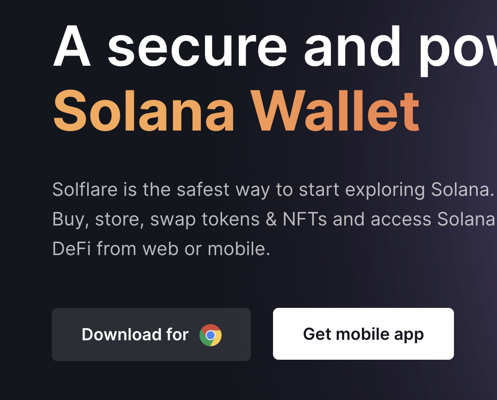

### 2. Open Wallets list
- 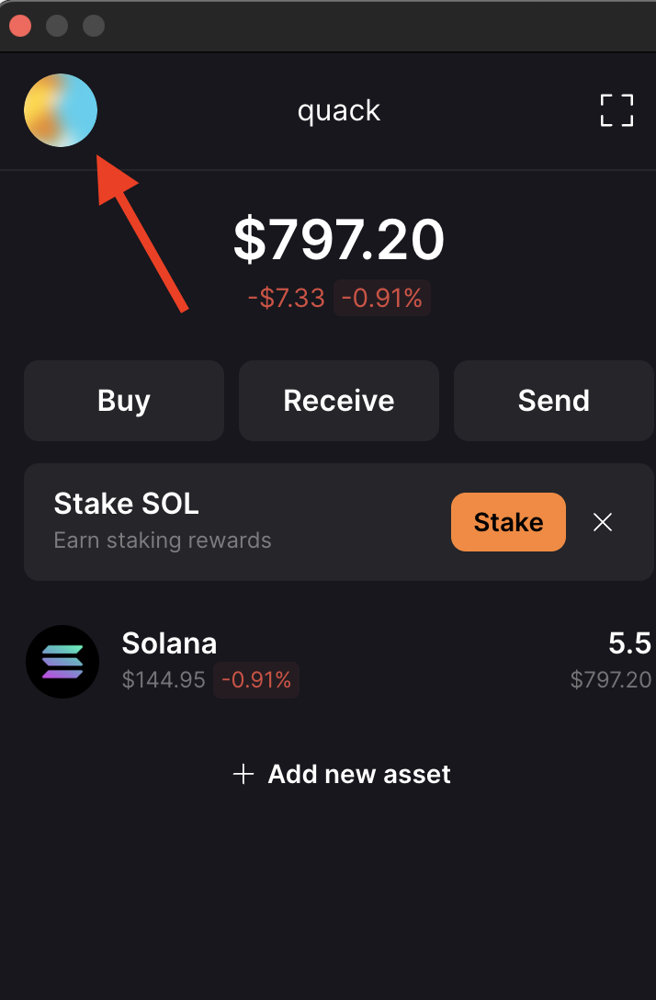

### 3. Press `+` button to add new wallet
- 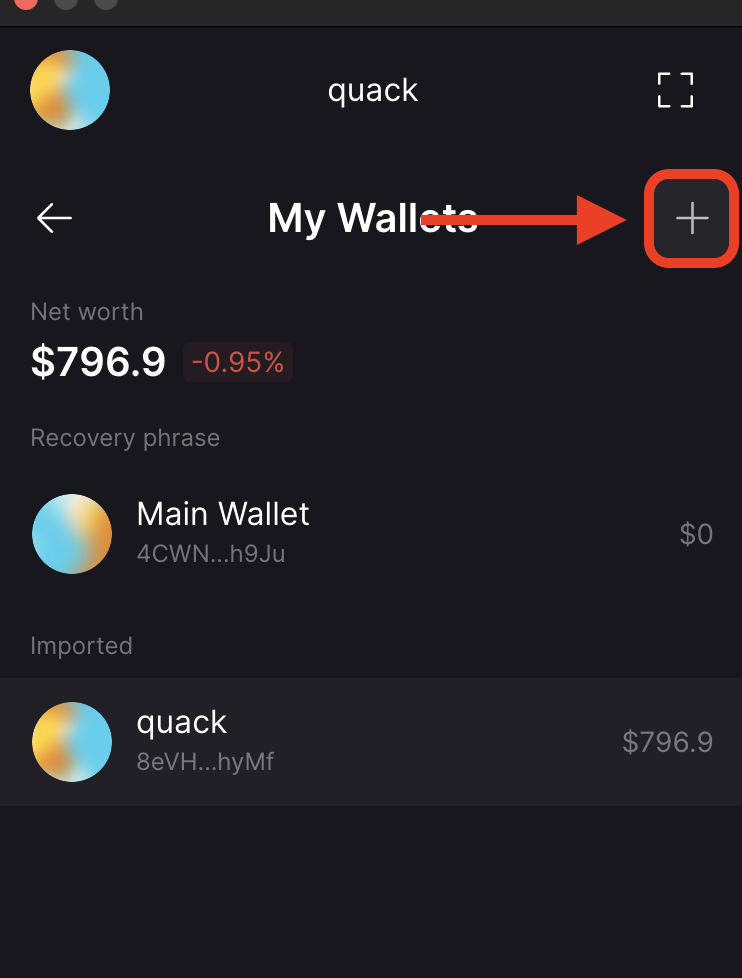

### 4. Select a import method (`import private key`)
- 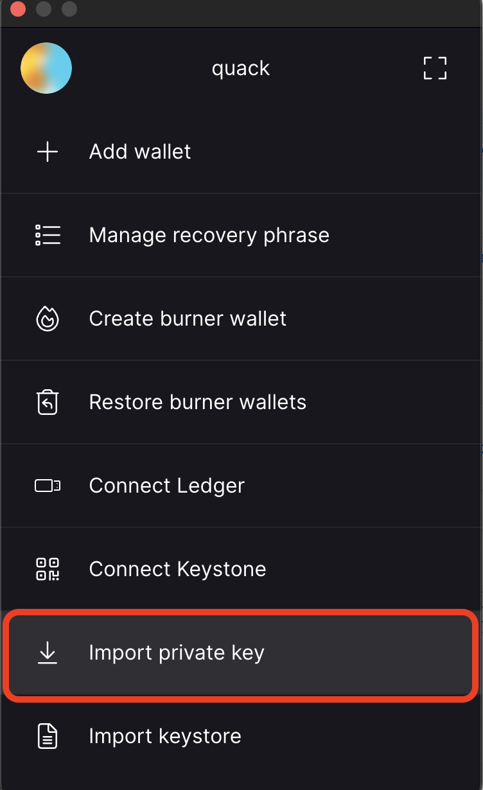

### 5. Paste your private/secret key encoded in `Basse58` encoding
- 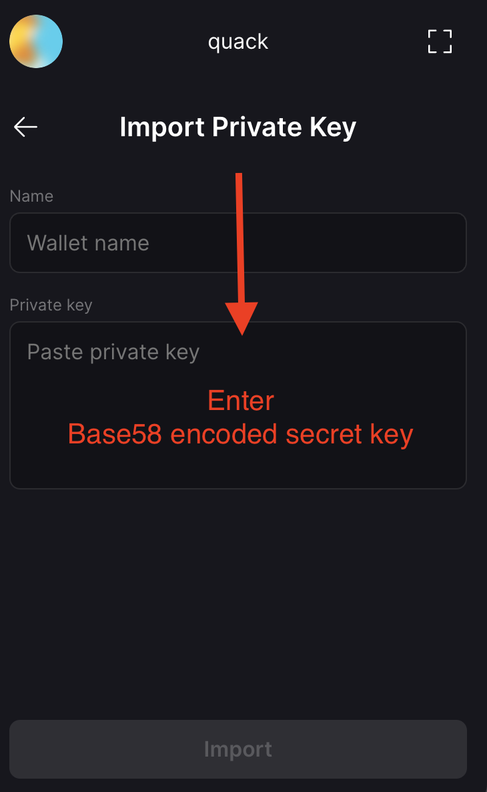


## Change Network
> You need to select network which you used for Airdrop

### 1. Go to Settings
- 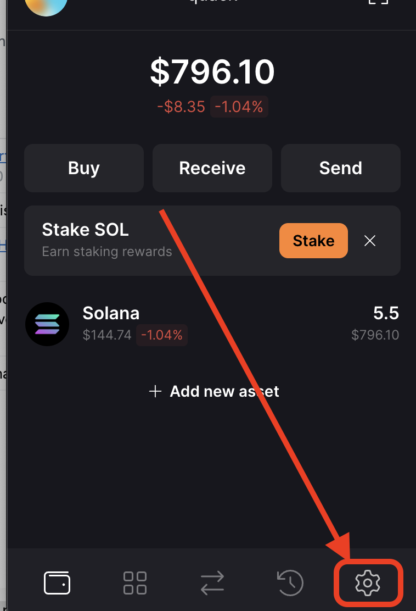

### 2. Open General Settings
- 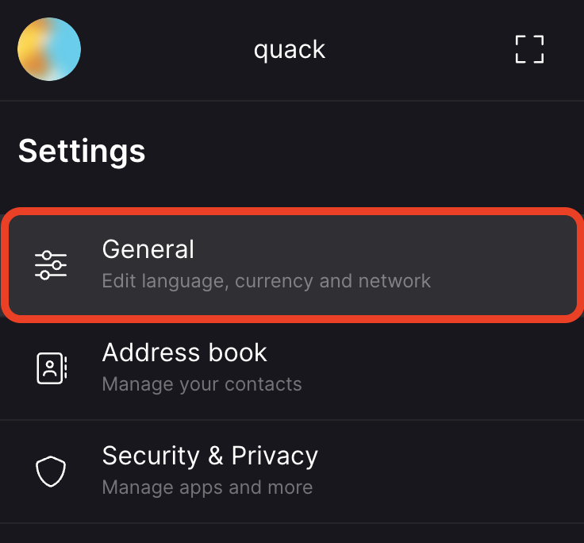

### 3. Open Network Settings
- 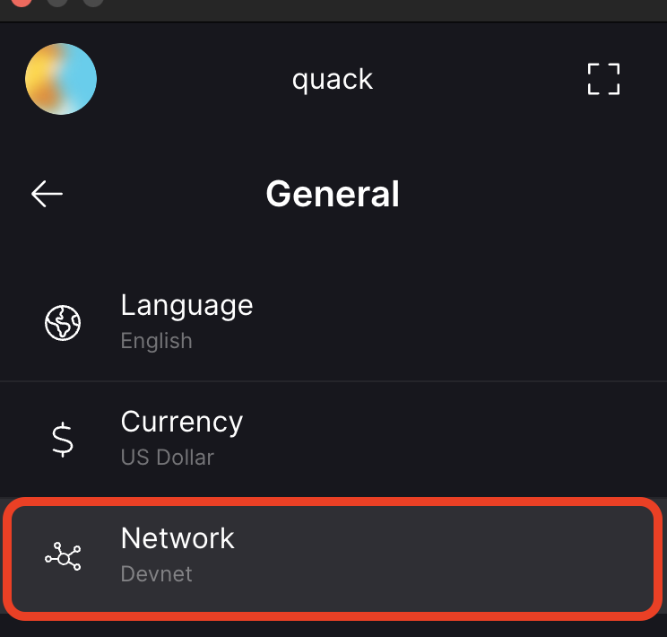

### 4. Change the Network to one you used to Airdrop/send `SOL` to
- 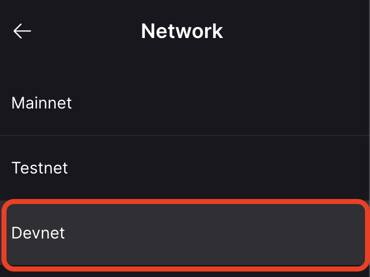


## Results
### 1. In CLI:
```sh
npx esrun src/getbalance
```
- 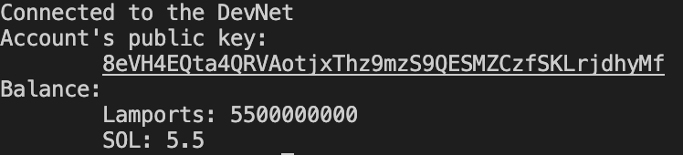

### 2. In web wallet:
- 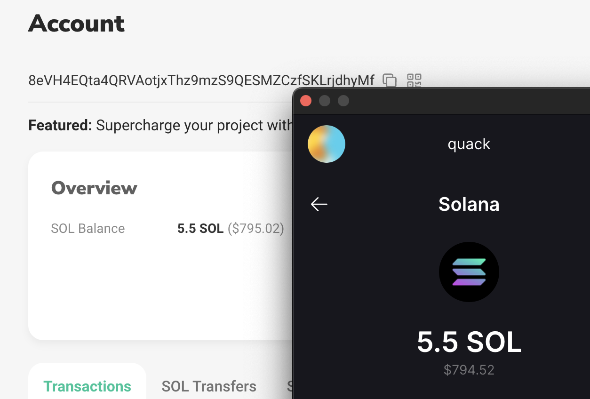
