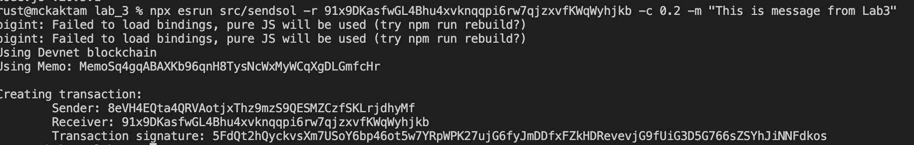
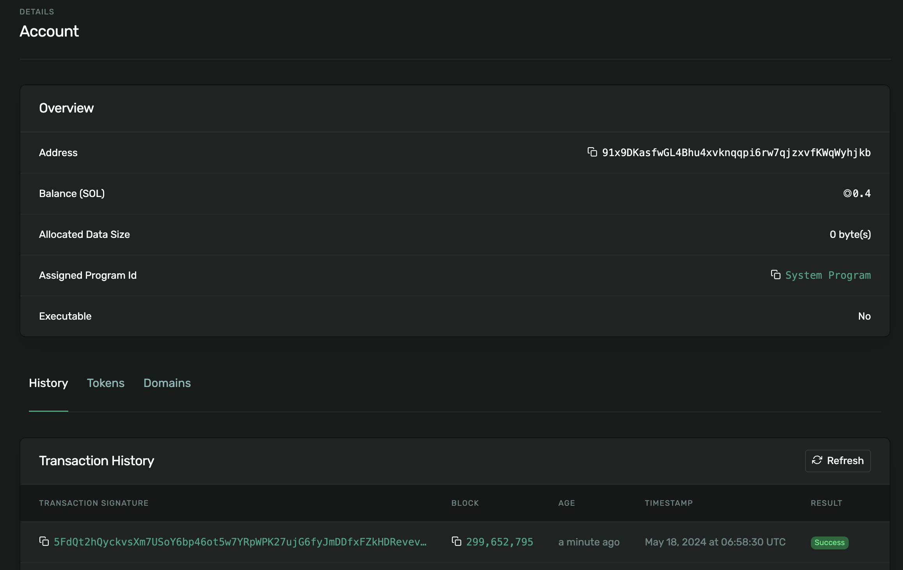
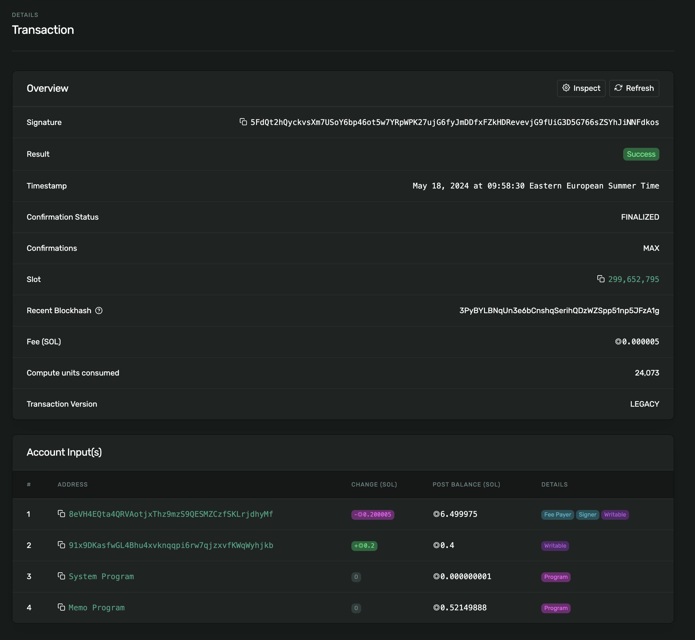
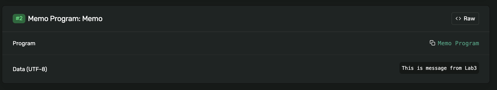

# Lab 3


---
# Project Setup 
```sh
npm install
```

> Provide either an `.env` file containing `SECRET_KEY` variable with your secret key as a byte-array
> 
> Or provide public/secret key using CLI options: `--public-key` or `--secret-key` respectively


# Scripts
#### 1. `src/sendsol.ts`
> Send some solana and attach a Memo note using special on-chain Program called [Memo](https://spl.solana.com/memo)

##### Example usage:
```sh
npx esrun src/sendsol --receiver 91x9DKasfwGL4Bhu4xvknqqpi6rw7qjzxvfKWaWyhjkb --sol-amount 0.2 --message MyMessage
```

Results:
<details>
    <summary>Screenshots</summary>
    1. CLI
        - 
    2. Account state in blockchain
        -  
    3. Transaction state in blockchain
        -  
    4. Transaction Memo Message
        -  

</details>
