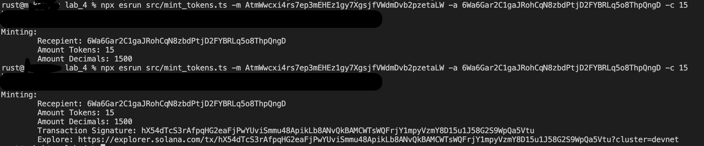

# Lab 4


---
# Project Setup 
```sh
npm install
```

> Provide either an `.env` file containing `SECRET_KEY` variable with your secret key as a byte-array
> 
> Or provide secret key using CLI options: `--secret-key` respectively


# Configuration
### Environment
> Export Environment variables or put them into `.env` file


# Scripts
#### 1. `src/new_token.ts`
> Create a new Mint Token
```sh
npx esrun src/new_token
```

**Settings:**
- Environment vars:
    - `SECRET_KEY` - secret key of the owner/signer of Mint Account that is being created
- Command-line options:
    - `--secret-key` - same as above env variable

**Example:**
<details>
    <summary>Screenshots</summary>
    
</details>


### 2. `src/new_account.ts`
> Create new Token Account

```sh
npx esrun src/mint_tokens -m <mint_token_account_pubkey> -a <assoociated_solana_account_pubkey>
```

**Settings:**
- Environment vars:
    - `SECRET_KEY` - secret key of the owner/signer
    - `MINT_ACCOUNT` - Token Account created by `1` script
- Command-line options:
    - `--secret-key` - same as above env variable 
    - `-m` or `--mint-account` - public key for Mint Account (same as above `MINT_ACCOUNT` and takes priority over it if set)
    - `-a` or `--target-account` - associated account (Solana account) to create Token Account for

**Example:**
<details>
    <summary>Screenshots</summary>
    
</details>


### 3. `src/mint_tokens.ts`
> Mint tokens to the target token account that is associated with solana address
```sh
npx esrun src/mint_tokens -m <mint_token_pubkey> -a <token_account_pubkey>
```

- Environment vars:
    - same as above 
- Command-line options:
    - same as above, but instead of `-a` being Solana Account
    - `-a` or `--target-account` - is a target Mint Token Account to send funds(tokens) to - a.k.a. recepient

**Example:**
<details>
    <summary>Screenshots</summary>
    1. Mint
        - 
    2. Result
        - 
        - 
</details>
